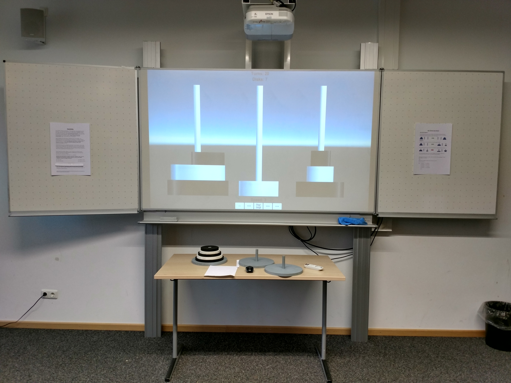
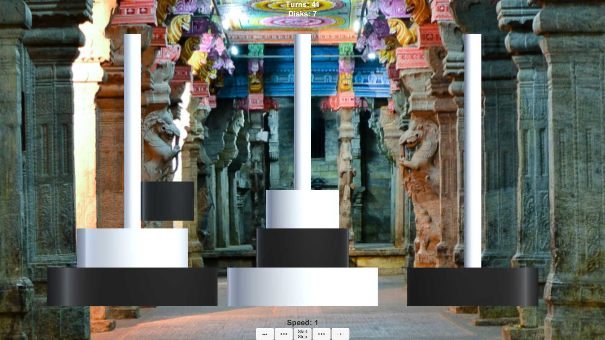

# Towers of Hanoi - Unity Visualization

## About
This is a Unity "game" visualizing the optimal solution for the Towers of Hanoi game.
I wrote this for the Math Expo at our high school, to introduce algorithmic problem solving to younger students.

## What is Towers of Hanoi?
The [Towers of Hanoi](https://en.wikipedia.org/wiki/Tower_of_Hanoi) is a famous puzzle where you have 3 towers and a stack of disks. You start with all the disks on one tower, largest on the bottom and smallest on top. The goal is to move all the disks to another tower, but you can only:
- Move one disk at a time
- Never put a larger disk on top of a smaller one

It sounds simple but it can get pretty challenging with more disks, if you haven't figured out the system behind it!
Especially if you try to solve it in the minimum number of moves required.

## This Project
I made this in Unity (which is a game engine) to show how the puzzle solves itself. You can watch it automatically solve the puzzle step by step. It's pretty satisfying to watch :D

The math behind it is actually really interesting - for n disks, you need exactly 2^n - 1 moves to solve it. So 3 disks = 7 moves, 4 disks = 15 moves, etc. The number of moves grows very quickly!

## How to Run
Just run the Hanoi.exe file in the Hanoi folder! 

## What I Learned
- Recursion is everywhere in computer science
- Math can look really interesting when you visualize it

Made with Unity 2017 for Math Expo 2017 ^^